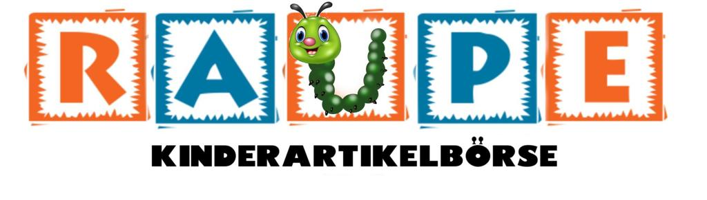

## Unsere AGBs
Allgemeine Geschäftsbedingungen Kinderartikelbörse Raupe

A - Allgemeine Bestimmungen

1. Geltungsbereich:
Diese Allgemeinen Geschäftsbedingungen (ABG) gelten für den Geschäftsbereich der Kinderartilekbörse Raupe.

2. Leistungsbereich:
Die Kinderartikelbörse verkauft gebrauchte Textilien, Schuhe, Bücher, Sportartikel und Spielzeuge in Kommission.

3. Änderungen:
Die Firma behält sich vor die AGB´s bei Saisonwechsel zu ändern oder anzupassen. Für unsere Kunden gilt die Version der zum Zeitpunkt des Vertragsabschlusses geltenden Bestimmungen, ausser die Kundin hat den aktuell geltenden AGB’s zugestimmt.

B - Bestimmungen zur Annahme

1. Folgende Artikel werden angenommen:
•	Kinderkleider in den Grössen 44 – 164, Schuhe bis Grösse 42 (keine Socken & Unterwäsche)
•	Sportartikel wie beispielsweise Kindervelos oder Schlittschuhe 
•	Kinder- und Jugendbücher
•	Spielzeuge wie bespielsweise Lego, Lego Duplo, Playmobil, Brio, Holzspielsachen oder Gesellschaftsspiele (vollständig)

Je nach Platzangebot behält sich die Kinderartikelbörse Raupe vor, die Annahme von Waren zu stoppen.

2. Eigentum der Ware
Alle Waren werden als Kommissionsware der Kundin entgegengenommen und bleiben bis zum  Verkauf durch die Kinderartikelbröse Raupe in deren Besitz.

3. Warenannahme
Alle Textilien müssen frisch gewaschen und ohne Flecken, Löcher oder Risse sein. Spielzeuge müssen gereinigt, unbeschädigt und vollständig sein.

Generell können immer Waren zu den Öffnungszeiten abgegeben werden.

4. Nicht verkaufte Artikel
Auf Artikel die sich in einem Zeitraum bis 6 Monaten nicht verkauft haben, entfällt der Anspruch der Kundin auf die Ware ohne Rücksprache. Die Kinderartikelbörse Raupe behält sich vor, die Ware einzulagern und in der nächsten Saison noch einmal anzubieten, an ein Hilfswerk zu spenden oder zu entsorgen.

Ohne eine ausdrückliche Vereinbarung können zu einem späteren Zeitpunkt keine Ansprüche geltend gemacht werden.

C - Bestimmungen zur Preispolitik:

5. Preisgestaltung
Die Verkaufspreise werden durch das Personal der Börse festgelegt.

Die Höhe der Preise hängen jeweils von Marke und Zustand der Ware ab.

Wir behalten uns vor, jederzeit Preisreduktionen auf sämtliche Artikel vorzunehmen oder Saisonal einen SALE zu machen.

6. Konditionen und Auszahlung
50% des erlösten Preises gehen an die Besitzerin der Ware.
50% gehen an die Börse.

Der Anteil an unsere Kundinnen wird automatisch auf Ihr Kundenkonto gebucht.
Auszahlungen können im Laden via Twint oder Bar ausbezahlt werden, oder in Waren bezogen werden.

Das Guthaben wird 24 Monate ab Verkauf der Ware aufgehoben. Danach verfällt es.

7. Haftungsausschluss
Wir lehnen jede Haftung bei Verlust oder Beschädigungen der Ware unserer Kundinnen durch Wasser, Feuer, Diebstahl, Verlust der Etiketten oder Beschädigungen durch Drittpersonen ab.

8. Datenschutzbestimmungen
Der Verkäufer verarbeitet personenbezogene Daten des Kunden zweckgebunden und gemäss den gesetzlichen Bestimmungen. Die Daten werden in der Schweiz gespeichert.

Die zum Zwecke der Auszahlung der Provision angegebenen persönlichen Daten (wie zum Beispiel Name, E-Mail-Adresse, Anschrift, Zahlungsdaten) werden vom Verkäufer zur Erfüllung und Abwicklung des Vertrags verwendet. Diese Daten werden vertraulich behandelt und nicht an Dritte weitergegeben, die nicht am Bestell-, Auslieferungs- und Zahlungsvorgang beteiligt sind.

Der Kunde hat das Recht, auf Antrag unentgeltlich Auskunft zu erhalten über die personenbezogenen Daten, die vom Verkäufer über ihn gespeichert wurden. Zusätzlich hat er das Recht auf Berichtigung unrichtiger Daten, Sperrung und Löschung seiner personenbezogenen Daten, soweit keine gesetzliche Aufbewahrungspflicht entgegensteht.
   
2. April 2022, Zhanna Wälchli, Kinderartikelbörse Raupe

[back](./)
